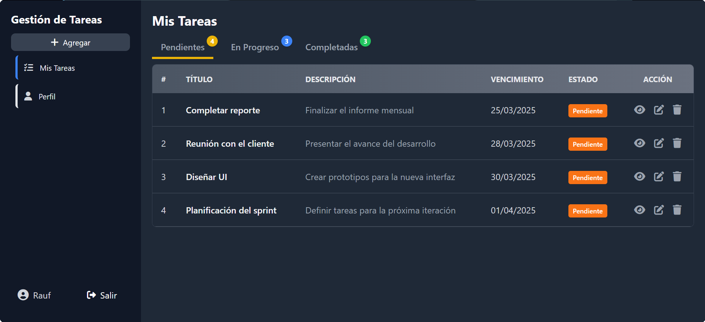

# Gestión de Tareas


Es una aplicación web diseñada para gestionar tareas personales de manera eficiente. Permite a los usuarios registrarse, iniciar sesión y administrar sus tareas con una interfaz moderna y responsiva. Utiliza Flask para el backend, MySQL para la base de datos y JavaScript para la interacción con la API. La interfaz está estilizada con Tailwind CSS y los íconos provienen de Font Awesome.



---

## Tecnologías Utilizadas
- **Backend:** Flask - Python 
- **Base de Datos:** MySQL
- **Frontend:** JavaScript
- **Estilos:** Tailwind CSS
- **Íconos:** Font Awesome

---

## Características  
- Registro e inicio de sesión de usuarios. 
- Creación, actualización y eliminación de tareas.  
- Marcado de tareas (Pendiente, En Progreso, Completada)

---

## Instalación

### Requisitos Previos
- Python 3
- MySQL

### Pasos de Instalación
1. **Clona el repositorio:**
   ```sh
   git clone https://github.com/raufjavedev/task-manager.git
   ```
2. **Crea un entorno virtual e instala las dependencias:**
   ```sh
   python -m venv venv
   source venv/bin/activate  # En Windows usa venv\Scripts\activate
   pip install -r requirements.txt
   ```
3. **Crea el archivo `.env` en la raíz del proyecto y configura las credenciales:**  

> [!IMPORTANT]  
> Necesario para conectar la aplicación con la base de datos y su configuración.  

   ```env
   SECRET_KEY=[tu_clave_secreta]
   DB_USER=[tu_usuario]
   DB_PASSWORD=[tu_contraseña]
   DB_HOST=[servidor]
   DB_NAME=[nombre_de_base_de_datos]
   DB_PORT=[puerto]
   ```
4. **Configura la base de datos MySQL:**
> [!TIP]  
> Puedes gestionar la base de datos desde la terminal o usar herramientas como MySQL Workbench, DBeaver o phpMyAdmin.
   ```sh
   mysql -u root -p
   CREATE DATABASE task_manager;
   ```
   - **O bien, importa el archivo *[database.sql](database.sql)* con:**
     ```sh
     mysql -u root -p task_manager < database.sql
     ```
   - **O ejecuta este script:**
     ```sql
     CREATE TABLE users (
         id INT AUTO_INCREMENT PRIMARY KEY,
         full_name VARCHAR(100) NOT NULL,
         username VARCHAR(50) UNIQUE NOT NULL,
         password_hash VARCHAR(255) NOT NULL, 
         email VARCHAR(100) UNIQUE NOT NULL,
         created_at TIMESTAMP DEFAULT CURRENT_TIMESTAMP
      ) ENGINE = InnoDB;

     CREATE TABLE tasks (
         id INT AUTO_INCREMENT PRIMARY KEY,
         user_id INT NOT NULL,
         title VARCHAR(100) NOT NULL,
         description TEXT,
         status ENUM('Pendiente', 'En Progreso', 'Completada') DEFAULT 'Pendiente',
         due_date DATE,
         created_at TIMESTAMP DEFAULT CURRENT_TIMESTAMP,
         FOREIGN KEY (user_id) REFERENCES users(id) ON DELETE CASCADE
      )ENGINE = InnoDB;
     ```
5. **Ejecuta la aplicación**

   ```sh
   python app.py
   ```

---

## Uso
- Accede a la aplicación en `http://127.0.0.1:5000`
- Regístrate o inicia sesión para administrar tus tareas.
- Usa la interfaz intuitiva para crear, editar y eliminar tareas.

---

## Incluir Font Awesome y Tailwind en la Base Template  

Para utilizar los íconos de Font Awesome, asegúrate de incluir su Kit en `base.html`. Consulta la documentación oficial para más detalles: [FontAwesome - Get Started](https://fontawesome.com/start)

```html
<head>
    <script src="https://kit.fontawesome.com/tu-kit.js" crossorigin="anonymous"></script>

    <!-- En producción, remover el CDN de Tailwind y utilizar una versión compilada localmente -->
</head>

```
> [!IMPORTANT]
> En entornos de producción, es recomendable evitar el uso del CDN de Tailwind por razones de seguridad y rendimiento. En su lugar, instala Tailwind CSS localmente y genera un archivo CSS optimizado. Consulta la documentación oficial para más detalles: [Tailwind CSS - Installation Guide](https://tailwindcss.com/docs/installation/using-vite).

---

## Endpoints

Listado de los principales endpoints de la aplicación.

| Método | Endpoint         | Descripción                  |
|--------|-----------------|------------------------------|
| POST   | /register       | Registro de nuevos usuarios |
| POST   | /login          | Autenticación de usuario    |
| GET    | /tasks          | Obtener todas las tareas    |
| POST   | /tasks          | Crear una nueva tarea       |
| PUT    | /tasks/id       | Actualizar una tarea        |
| DELETE | /tasks/ id      | Eliminar una tarea          |

---

## Licencia 

Este proyecto está bajo la [Licencia Apache 2.0](LICENSE). 


